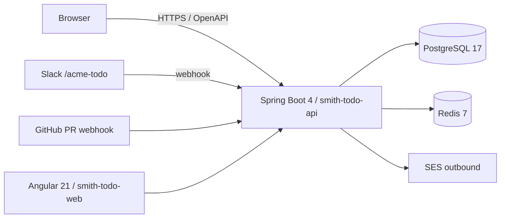

# Acme Todo — Technical specification

## 1. Architecture

Front-end Angular 21 SPA + Spring Boot 4 backend. PostgreSQL 17 is the
system of record ; Redis 7 caches session tokens + the weekly-digest
generation lock. Outbound email goes through AWS SES.

## 2. Modules

| Module | Purpose | Outgoing deps |
|---|---|---|
| `smith-todo-api` | REST controllers + service layer | smith-todo-data, Redis, SES |
| `smith-todo-data` | JPA entities, repositories, Liquibase migrations | PostgreSQL JDBC |
| `smith-todo-integrations` | Slack + GitHub webhook handlers | smith-todo-api |
| `smith-todo-web` | Angular 21 SPA | smith-todo-api OpenAPI client |
| `smith-todo-common` | Shared DTOs, error envelopes, MDC filters | (none) |

## 3. Inbound interfaces

- **REST** — `/api/v1/**`, OpenAPI doc at `backend/openapi/openapi.json`,
  auth via Acme SSO bearer.
- **Slack webhook** — `POST /webhooks/slack` ; signature-validated.
- **GitHub webhook** — `POST /webhooks/github` ; HMAC-signed.
- **Scheduler** — `weekly-digest` (Mon 09:00 UTC), `overdue-tagger`
  (every 15 min).

## 4. Persistence

- PostgreSQL 17, schema migrated via Liquibase YAML under
  `backend/smith-todo-data/src/main/resources/db/changelog/`.
- Main entities :
  - `users(id, public_id, email, display_name, role, created_at)`
  - `projects(id, public_id, name, owner_id, created_at)`
  - `todos(id, public_id, project_id, title, description, due_date, status, assignee_id, created_at)`
  - `todo_collaborators(todo_id, user_id, role)`
  - `todo_history(id, todo_id, actor_id, change_type, change_payload, occurred_at)`
- Dual-id pattern : every entity carries an internal `long` PK and a public `UUID v7`.

## 5. Cross-cutting concerns

- **Auth** — Acme SSO (SAML 2.0) → JWT bearer ; Redis caches user sessions (15 min TTL).
- **Logging** — SLF4J + Logback in JSON ; MDC carries `traceId`, `userId`.
- **Metrics** — Micrometer → Prometheus ; HTTP timings, DB query timings,
  Slack/GitHub webhook counters.
- **Caching** — Redis 7 for sessions + the weekly-digest distributed lock.
- **Async** — Spring `@Async` for non-critical work (digest emails) ; backed by a 4-thread executor.

## 6. Build + CI

- Build : Maven 3.9 + Java 24, multi-module reactor under `backend/pom.xml`.
- Frontend : npm 11, Vite via `ng build`.
- CI : GitHub Actions — `ci.yml` (PR validation), `release.yml` (tag → deploy to staging).

## 7. Known gaps

- The `todo_history` table grows without bound — partitioning planned for v1.2.
- No rate-limiting on the Slack webhook ; relies on Slack's per-app cap.
- E2E tests live under `e2e/` (Playwright) but only the smoke suite runs in CI ; the
  full suite runs nightly only.
